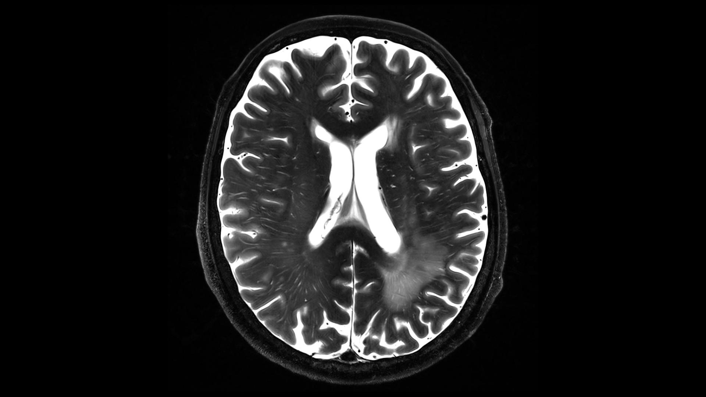
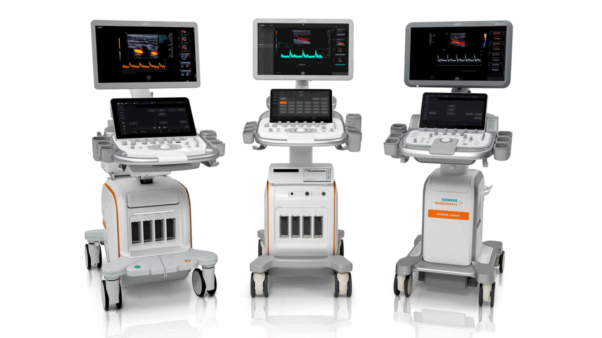

#IEEE_Mohamed-Abdelaziz_Medical-Equipment-Starter-Pack
## Magnetic Resonance Imaging
This is a brief introduction for MRI regarding MRI Physics, T1 and T2 Relaxation, Pulse Sequences, Parameters, and Image Artifacts.

## Ultrasound Imaging
This is a brief introduction for Ultrasound regarding Ultrasound Physics and Ultrasound Modes of operation.

